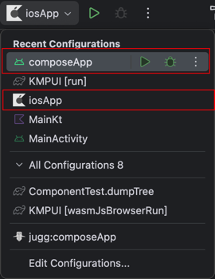

# KMP Cross-platform UI Demo

> For KotlinConf'24 Shenzhen
>
> Slide: [KMP Cross-platform UI](./rosu_kotlinconf_shenzhen.pdf)

## Introduction

This is a demo project for the KotlinConf'24 Shenzhen talk. It demonstrates how to build a cross-platform UI application using Kotlin Multiplatform.

- `composeApp`: The Compose UI application for All platforms.
  - `androidMain`: Android specific code.
  - `iosMain`: iOS specific code.
  - `desktopMain`: JVM Desktop specific code.
  - `wasmMain`: Kotlin/wasm specific code.
  - `commonMain`: Shared code, all UI cross-platform code should be put here. 
    - This module will generate a non-platform-specific DOM tree.
    - The platform-specific code will render the DOM tree to the platform-specific UI.


## How to run

### 1. Prepare the environment, using [KDoctor](https://github.com/Kotlin/kdoctor)
- Android: Android Studio should install the [KMP Plugin](https://plugins.jetbrains.com/plugin/14936-kotlin-multiplatform).
- iOS: Xcode and at least one iOS simulator.

### 2. Sync the project

### 3. Android && iOS should using Android Studio built-in configuration to run the project.



### Other platforms

```shell
# JVM Desktop
./gradlew :composeApp:Run

# Kotlin/wasm
./gradlew :composeApp:wasmJsBrowserRun

```


